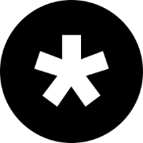

<a id="readme-top"></a>


<!-- PROJECT LOGO -->
<br />
<div align="center">
  <a href="https://github.com/vinc3w/vinc3w.github.io">
    
  </a>
  <h3 align="center">Vincent Har</h3>
  <p align="center">A Portfolio Website!</p>
</div>


<!-- ABOUT THE PROJECT -->
## About Project

![Main screenshot][main.png]

This portfolio website is a personal showcase of my work as a Full Stack Web Developer, highlighting my skills, projects, and journey in the world of software development. Built with a focus on clean design, intuitive navigation, and responsive layouts, it reflects both my technical expertise and my eye for user experience.

The site includes dedicated sections for my background, philosophy, skills, and selected projects, along with a contact page for potential employers and collaborators. Beyond being a static showcase, it’s designed to be a living project that grows with my experience and evolves as I refine my craft.

<p align="right">(<a href="#readme-top">back to top</a>)</p>


### Built With

All major frameworks/libraries used.

- [![SvelteKit][SvelteKit]][SvelteKit-url]
- [![GSAP][GSAP]][GSAP-url]

<p align="right">(<a href="#readme-top">back to top</a>)</p>


<!-- GETTING STARTED -->
## Getting Started

To get a local copy up and running follow these simple example steps.

### Installation

Follow the steps below to install the project.

1. Clone the repo
   ```sh
   git clone https://github.com/vinc3w/vinc3w.github.io.git
   ```
2. Install server NPM packages and run
   ```sh
   cd vinc3w.github.io
   npm install
   npm run dev
   ```

<p align="right">(<a href="#readme-top">back to top</a>)</p>


<!-- SCREENSHOTS EXAMPLES -->
## Screenshots

![Desktop][desktop.png]
![Mobile][mobile.png]
![Footer][footer.png]
![Menu][menu.png]

<p align="right">(<a href="#readme-top">back to top</a>)</p>


<!-- MARKDOWN LINKS & IMAGES -->
[logo.png]: assets/logo.png
[main.png]: assets/thumbnail.png

[desktop.png]: assets/desktop-thumbnail.png
[mobile.png]: assets/mobile-thumbnail.png
[footer.png]: assets/footer.png
[menu.png]: assets/menu.png

[SvelteKit]: https://img.shields.io/badge/SvelteKit-%23f1413d.svg?logo=svelte&logoColor=white
[SvelteKit-url]: https://svelte.dev/
[GSAP]: https://img.shields.io/badge/GSAP-%230ae448.svg?logo=gsap&logoColor=white
[GSAP-url]: https://gsap.com/