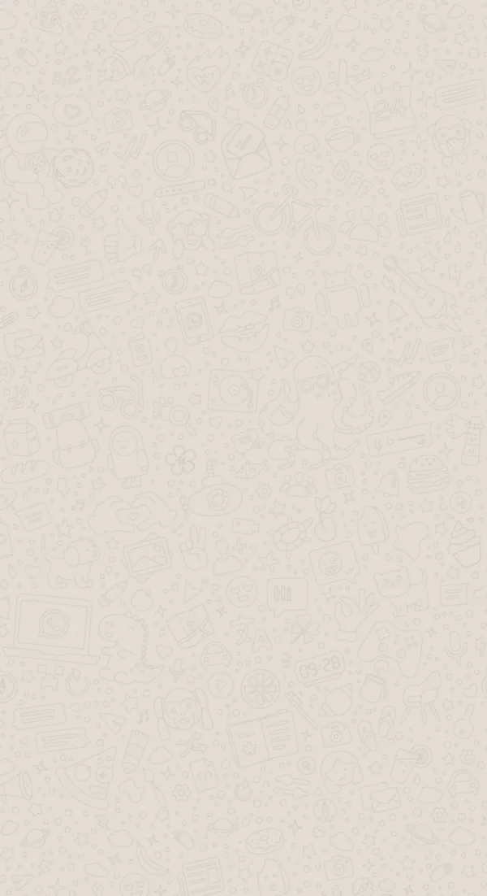

# Vinc3w

This is my portfolio where I display what skills I possessed and what projects that I had worked on before.

### Resources used

[Font Awesome Icons](https://fontawesome.com/) 
[Developers Icons](https://devicon.dev/) 
[Cascadia Code Font Family](https://github.com/microsoft/cascadia-code) 
[Whatsapp Background Image](https://www.reddit.com/r/whatsapp/comments/f1clby/default_whatsapp_background_for_people_who_lost/)